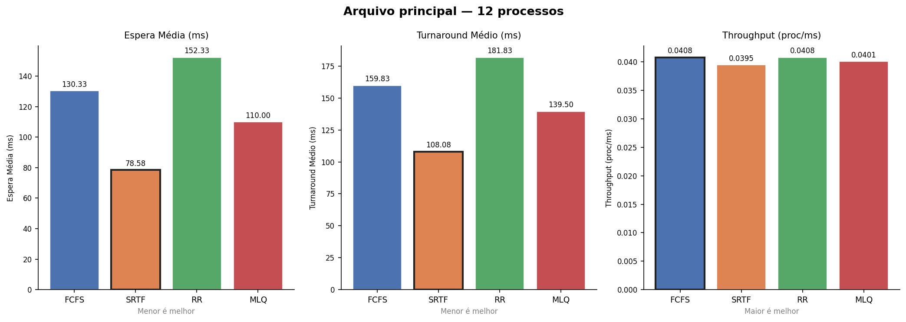
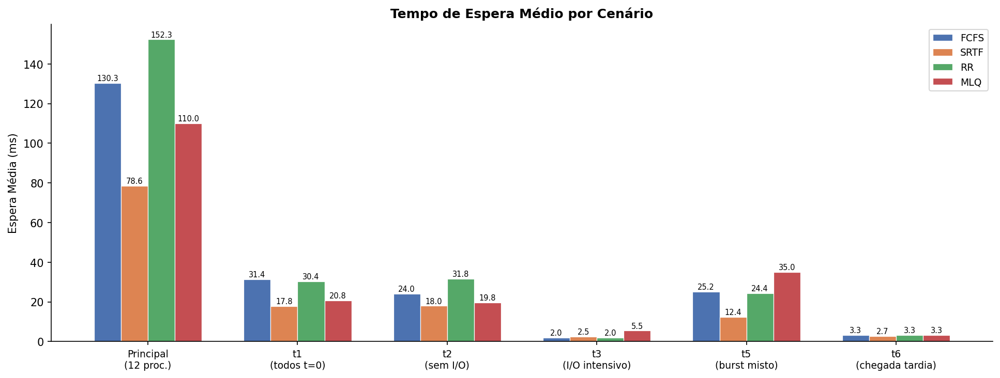
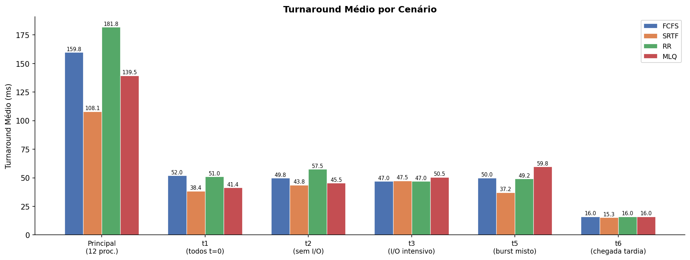
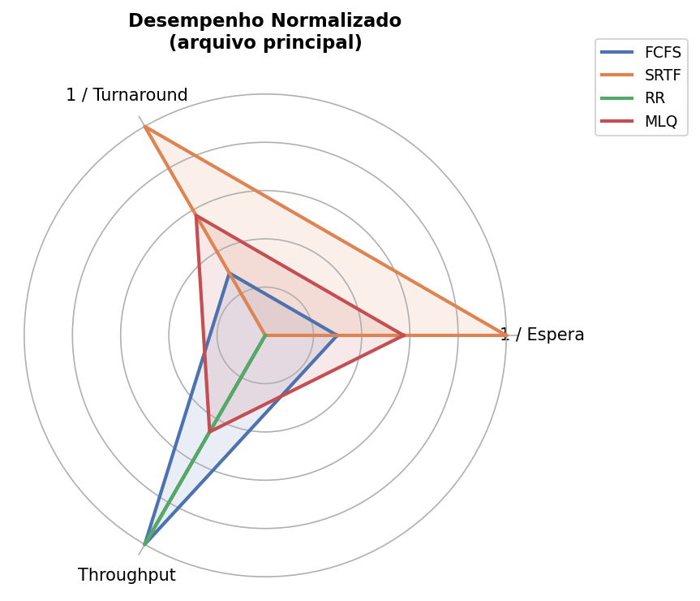

# Relatório Comparativo de Algoritmos de Escalonamento

**Disciplina:** Sistemas Operacionais  
**Instituição:** PUC Minas  
**Integrantes:** Arthur Mendes · Henrique Caldeira · Guilherme Sabino · Vinicius Sena

---

## 1. Introdução

Este relatório apresenta os resultados da simulação de quatro algoritmos de escalonamento de processos implementados em Java 25. O objetivo é comparar o desempenho de cada algoritmo a partir de três métricas quantitativas — tempo de espera médio, turnaround médio e throughput — e discutir qualitativamente os trade-offs de cada política para diferentes perfis de carga.

Os algoritmos avaliados são:
- **FCFS** (First Come, First Served)
- **SRTF** (Shortest Remaining Time First)
- **RR** (Round-Robin com quantum por predição de média exponencial)
- **MLQ** (Multilevel Queue com duas filas de prioridade)

---

## 2. Metodologia

A simulação foi conduzida com o arquivo `processos.txt`, contendo 12 processos com características variadas: chegadas simultâneas, processos sem I/O, processos com múltiplos I/Os, prioridades distintas e bursts de 6 ms a 50 ms. Cada scheduler recebeu uma cópia independente dos processos, garantindo que a execução de um não interfira nos demais.

O I/O é modelado como bloqueio fixo de 5 ms. O instante de I/O é definido pelo tempo de CPU acumulado pelo processo, não pelo relógio global. Além do arquivo principal, foram executados seis cenários de casos extremos descritos na Seção 3.2.

---

## 3. Resultados

### 3.1 Arquivo principal (`processos.txt` — 12 processos)

| Algoritmo | Espera Média (ms) | Turnaround Médio (ms) | Throughput (proc/ms) |
|-----------|:-----------------:|:---------------------:|:--------------------:|
| FCFS      | 130,33            | 159,83                | 0,0408               |
| SRTF      | **78,58**         | **108,08**            | 0,0395               |
| RR        | 152,33            | 181,83                | 0,0408               |
| MLQ       | 110,00            | 139,50                | 0,0401               |

> SRTF apresenta menor espera e turnaround. RR tem o pior tempo de espera neste cenário — reflexo do quantum inicial alto (τ₀ = 10 ms) e do overhead de múltiplas preempções antes do τ convergir.

---

### 3.2 Casos extremos

#### t1 — Todos os processos chegam em t=0 (5 processos)

| Algoritmo | Espera Média (ms) | Turnaround Médio (ms) | Throughput (proc/ms) |
|-----------|:-----------------:|:---------------------:|:--------------------:|
| FCFS      | 31,40             | 52,00                 | 0,0538               |
| SRTF      | **17,80**         | **38,40**             | 0,0510               |
| RR        | 30,40             | 51,00                 | 0,0538               |
| MLQ       | 20,80             | 41,40                 | 0,0510               |

#### t2 — Processos sem nenhum I/O (4 processos)

| Algoritmo | Espera Média (ms) | Turnaround Médio (ms) | Throughput (proc/ms) |
|-----------|:-----------------:|:---------------------:|:--------------------:|
| FCFS      | 24,00             | 49,75                 | 0,0388               |
| SRTF      | **18,00**         | **43,75**             | 0,0388               |
| RR        | 31,75             | 57,50                 | 0,0388               |
| MLQ       | 19,75             | 45,50                 | 0,0388               |

> Todos com o mesmo throughput: sem I/O, o tempo total simulado é idêntico. As diferenças concentram-se na distribuição da espera entre os processos.

#### t3 — I/O intensivo (I/O a cada 1-2 ms de CPU acumulada, 2 processos)

| Algoritmo | Espera Média (ms) | Turnaround Médio (ms) | Throughput (proc/ms) |
|-----------|:-----------------:|:---------------------:|:--------------------:|
| FCFS      | **2,00**          | **47,00**             | 0,0392               |
| SRTF      | 2,50              | 47,50                 | 0,0364               |
| RR        | **2,00**          | **47,00**             | 0,0392               |
| MLQ       | 5,50              | 50,50                 | 0,0392               |

> Resultado contraintuitivo: o SRTF perde para o FCFS neste cenário. Com I/O muito frequente, os dois processos têm bursts restantes semelhantes a todo momento, tornando as preempções do SRTF desnecessárias e gerando overhead sem ganho real. O MLQ é o pior porque o processo de prioridade 2 precisa esperar todos os ciclos de I/O do processo de prioridade 1.

#### t4 — Processo único (1 processo)

| Algoritmo | Espera Média (ms) | Turnaround Médio (ms) | Throughput (proc/ms) |
|-----------|:-----------------:|:---------------------:|:--------------------:|
| Todos     | 0,00              | 30,00                 | 0,0333               |

> Resultado idêntico para todos os algoritmos — valida a corretude da implementação: sem concorrência, não há espera.

#### t5 — Burst misto: 1-2 ms com 55-60 ms (5 processos)

| Algoritmo | Espera Média (ms) | Turnaround Médio (ms) | Throughput (proc/ms) |
|-----------|:-----------------:|:---------------------:|:--------------------:|
| FCFS      | 25,20             | 50,00                 | 0,0403               |
| SRTF      | **12,40**         | **37,20**             | 0,0420               |
| RR        | 24,40             | 49,20                 | 0,0420               |
| MLQ       | 35,00             | 59,80                 | 0,0420               |

> O MLQ é o pior neste cenário porque o processo longo de prioridade 2 (P3, burst 60 ms) é bloqueado repetidamente pelos processos de prioridade 1 — mesmo os de burst curtíssimo (1-2 ms) que chegam depois. O SRTF é o melhor, drenando rapidamente os processos curtos.

#### t6 — Chegada tardia (idle time de ~82 ms entre t=18 e t=100, 3 processos)

| Algoritmo | Espera Média (ms) | Turnaround Médio (ms) | Throughput (proc/ms) |
|-----------|:-----------------:|:---------------------:|:--------------------:|
| FCFS      | 3,33              | 16,00                 | 0,0250               |
| SRTF      | **2,67**          | **15,33**             | 0,0250               |
| RR        | 3,33              | 16,00                 | 0,0250               |
| MLQ       | 3,33              | 16,00                 | 0,0250               |

> O throughput de 0,0250 proc/ms reflete o grande período ocioso: o simulador contabiliza o tempo total até o último processo terminar, diluindo o throughput mesmo que os processos em si sejam rápidos.

---

## 4. Análise qualitativa

### 4.1 FCFS

O FCFS é o algoritmo mais simples: executa na ordem de chegada, sem preempção. Isso garante ausência de inanição, mas produz o **efeito convoy** — um processo longo bloqueia todos os processos curtos que chegam depois. Nos resultados do arquivo principal, o FCFS tem espera média de 130,33 ms, segunda maior entre os quatro. No cenário de I/O intensivo (t3), porém, o FCFS empata com o RR e supera o SRTF, evidenciando que sua simplicidade pode ser vantajosa quando os processos têm comportamento simétrico e não há ganho real em preempção.

### 4.2 SRTF

O SRTF é ótimo em tempo médio de espera para cargas sem I/O e foi o melhor em quase todos os cenários testados. No arquivo principal, reduziu a espera média em 40% em relação ao FCFS (78,58 ms vs. 130,33 ms). A exceção é o cenário de I/O intensivo (t3): com dois processos que se bloqueiam frequentemente, seus bursts restantes ficam perpetuamente próximos, tornando as preempções inúteis e introduzindo overhead que eleva a espera para 2,50 ms contra 2,00 ms do FCFS. O risco de inanição de processos longos em cargas mistas também é real, conforme observado na penalização de P2 e P7 (prioridade 2, bursts longos) no arquivo principal.

### 4.3 Round-Robin com Quantum por Predição

O RR garantiu equidade — nenhum processo monopolizou a CPU — mas apresentou o **maior tempo de espera no arquivo principal** (152,33 ms). A razão principal é o τ₀ = 10 ms: no início da simulação, todos os processos têm o mesmo τ, então o quantum é 10 ms independentemente do perfil real de cada processo. Isso gera muitas trocas de contexto desnecessárias antes do τ convergir para o comportamento histórico. Nos cenários com poucos processos (t1, t2, t6), o RR fica próximo do FCFS, indicando que a vantagem adaptativa se manifesta melhor com mais diversidade de processos e mais tempo para o τ estabilizar.

### 4.4 MLQ

O MLQ garantiu latência baixa para processos de prioridade 1, mas ao custo do pior desempenho no cenário de burst misto (t5): espera média de 35,00 ms contra 12,40 ms do SRTF. O processo longo de prioridade 2 (P3, burst 60 ms) foi repetidamente preemptado por processos de prioridade 1, mesmo que estes fossem curtíssimos. No cenário de I/O intensivo (t3), o MLQ também foi o pior (5,50 ms de espera), porque o processo de prioridade 2 ficou represado enquanto o de prioridade 1 alternava entre CPU e I/O. O MLQ é adequado quando a separação por classes de processo é importante, mas exige cuidado com inanição da fila de baixa prioridade.

---

## 5. Síntese visual

O gráfico radar abaixo normaliza as três métricas (espera e turnaround invertidos — menor é melhor; throughput direto) para comparar os algoritmos em um único plano. A área de cada polígono representa o desempenho geral: quanto maior, melhor.

---

## 6. Conclusão

| Critério | Melhor algoritmo | Observação |
|---|---|---|
| Menor tempo médio de espera | **SRTF** | Vantagem de ~40% sobre FCFS no cenário principal |
| Menor turnaround médio | **SRTF** | Consistente em todos os cenários, exceto t3 |
| Maior equidade | **RR** | Nenhum processo monopoliza a CPU |
| Melhor responsividade para alta prioridade | **MLQ** | Garante preferência estrita à Fila 1 |
| Melhor adaptação a I/O intensivo | **FCFS / RR** | SRTF perde vantagem quando bursts restantes são similares |
| Menor overhead de implementação | **FCFS** | Sem preempção, sem estruturas auxiliares |

O SRTF é teoricamente superior e os resultados confirmam isso na maioria dos cenários, mas requer conhecimento implícito dos bursts e pode causar inanição. O RR com quantum adaptativo é o melhor equilíbrio para cargas mistas e longas simulações, onde o τ tem tempo de convergir. O MLQ é a escolha natural quando o sistema possui classes de processos bem definidas com requisitos de QoS distintos. O FCFS permanece relevante pela previsibilidade e ausência de overhead — especialmente em cargas homogêneas ou I/O-intensivas.
